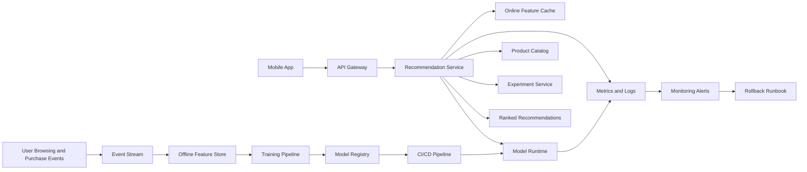

# Retail Home Recommendation MLOps System

## Executive Summary

This repository designs an MLOps system for **Scenario X: personalized in-app recommendations for a B2C retail mobile application**. The system serves product recommendations on every home-screen load, supports **800 RPS at peak**, and targets a **120 ms end-to-end p95 latency budget**. It uses a low-latency online recommendation service backed by an online feature cache, a versioned model registry, containerized model serving, OpenAPI-defined sync, batch, and async endpoints, CI/CD promotion gates, burn-rate monitoring, drift detection, and a rollback runbook that can be executed during an incident.

## Architecture Diagram

The high-level system has two main paths:

1. **Online serving path** — handles real-time recommendation requests from the mobile app.
2. **Offline lifecycle path** — collects events, builds features, trains and evaluates models, registers approved versions, and deploys them through CI/CD.



For the detailed architecture and trade-offs, see [`architecture/architecture.md`](architecture/architecture.md) and [`architecture/JUSTIFICATION.md`](architecture/JUSTIFICATION.md).

## Key Numbers

| Item | Target / Assumption |
|---|---|
| Scenario | Personalized in-app recommendations |
| Peak traffic | 800 RPS |
| End-to-end p95 latency budget | 120 ms |
| Recommendation service p95 target | 60 ms |
| Availability SLO | 99.9% monthly |
| Latency SLO | p95 ≤ 120 ms end-to-end |
| Error-rate SLO | ≥ 99.5% successful recommendation responses |
| Production model | `retail-home-recommender` |
| Production model version | `recsys-2026.06.07-001` |
| Container image | `ghcr.io/acme-retail/retail-recommender:recsys-2026.06.07-001` |
| Model size estimate | ~250 MB |
| Model packaging strategy | Baked into the container image |
| Serving hardware | CPU pods, 4 vCPU / 8 GB RAM |
| Initial production replicas | 8 |
| Autoscaling range | 8–30 replicas |
| Estimated monthly cost | ~$1,600 for inference compute, cache, and monitoring |

## Repository Navigation

| Area | Primary Artifact | Purpose |
|---|---|---|
| Architecture | [`architecture/architecture.md`](architecture/architecture.md) | System diagram, request flow, and component responsibilities |
| Architecture justification | [`architecture/JUSTIFICATION.md`](architecture/JUSTIFICATION.md) | Explains why this design fits the scenario |
| ADRs | [`architecture/adr/`](architecture/adr/) | Records the most important design trade-offs |
| Lifecycle | [`lifecycle/lifecycle.md`](lifecycle/lifecycle.md) | End-to-end model lifecycle from data to production |
| Model registry | [`lifecycle/model-registry.yaml`](lifecycle/model-registry.yaml) | Registry fields, versions, gates, and lineage |
| Container | [`container/Dockerfile`](container/Dockerfile) | Reviewable multi-stage inference image |
| Container plan | [`container/README.md`](container/README.md) | Image strategy, base image, size estimate, and runtime plan |
| API contract | [`api/openapi.yaml`](api/openapi.yaml) | OpenAPI 3.1 contract for sync, batch, and async endpoints |
| API examples | [`api/examples/`](api/examples/) | Sample requests and responses |
| Serving | [`serving/capacity-plan.md`](serving/capacity-plan.md) | Capacity math, latency budget, and scaling assumptions |
| SLOs | [`serving/slos.yaml`](serving/slos.yaml) | Measurable SLO objectives |
| Load testing | [`serving/load-test-plan.md`](serving/load-test-plan.md) | Load test stages and pass/fail gates |
| CI/CD | [`cicd/.github/workflows/deploy-model.yml`](cicd/.github/workflows/deploy-model.yml) | Model deployment pipeline with security and production gates |
| Monitoring | [`monitoring/alerts.yaml`](monitoring/alerts.yaml) | Burn-rate, drift, and model-version mismatch alerts |
| Rollback | [`runbooks/rollback.md`](runbooks/rollback.md) | Incident checklist for reverting to the previous stable model |

## Open Questions

1. What business metric should be the primary online promotion gate: click-through rate, add-to-cart rate, revenue per session, or a weighted combination?
2. How fresh must user behavior features be for personalization: near-real-time, hourly, or daily?
3. Are there product categories or user segments where recommendations must be filtered for legal, safety, or business-policy reasons?


# Assessment | Design & Ship an MLOps System

## Overview

You will produce a complete MLOps design dossier for a fresh business scenario, integrating every artifact you've practiced this week. The deliverable is a single repository that another team could pick up on Monday and start building from. No model training, no notebooks — this is a systems and operations exercise.

The assessment covers the full Unit 7 arc: architecture → lifecycle → packaging → API contract → capacity & SLOs → CI/CD & monitoring. You will reuse every skill from the week's labs.

**Time budget:** Friday class. **Submission deadline:** Sunday 7 Jun 2026, 23:59 local time.

## Learning Goals Verified

This assessment verifies that you can:

- Translate a business scenario into a defensible architecture
- Specify the MLOps lifecycle and registry that surrounds a production model
- Package a containerized inference service with a slim, secure image
- Author a complete API contract (OpenAPI 3.1) with sync, batch, and async endpoints
- Plan capacity, SLOs, and a meaningful load test
- Wire up CI/CD and monitoring with explicit gates and burn-rate alerts
- Write a rollback runbook a tired on-call could execute

## Pick One Scenario

You **must** pick a scenario you did **not** use in earlier labs. Choose one:

### Scenario X — Personalized in-app recommendations (B2C retail)

A mobile retail app needs personalized product recommendations rendered on every home-screen load. ~800 RPS at peak, p95 latency budget 120 ms end-to-end. Personalization signals include the user's last 30 days of browsing and purchases. Cold-start users (no history) must still get reasonable recommendations. The product team will run A/B tests against the model continuously.

### Scenario Y — Predictive maintenance for industrial sensors (B2B IoT)

A factory automation product ingests vibration and temperature time-series from ~50,000 industrial sensors. The model predicts which sensors will fail in the next 72 hours. Decisions are made by maintenance schedulers reviewing a daily report; a small subset of critical sensors needs near-real-time alerting (<5 minutes from anomaly to alert). Data arrives via MQTT to a cloud ingestion layer.

### Scenario Z — Medical-imaging triage assistant (B2B healthcare)

A radiology workflow tool routes chest X-ray studies to radiologists based on a model's urgency score. ~30 studies/minute average, 100/minute peak. Each study can be up to 80 MB across multiple DICOM slices. p95 latency budget 4 seconds. **Regulated environment** — every prediction must be auditable; model promotion requires sign-off; data residency rules apply.

## Deliverables

Your submission is a single Git repository with this structure:

```
README.md                          # 1-page navigation + executive summary
architecture/
  architecture.md                  # diagram (Mermaid or PNG + source)
  JUSTIFICATION.md                 # pattern choice and trade-offs
  adr/
    0001-<slug>.md                 # the single most consequential trade-off
    0002-<slug>.md                 # one more
lifecycle/
  lifecycle.md                     # end-to-end diagram
  model-registry.yaml              # registry spec
container/
  Dockerfile                       # multi-stage; will not be built, but must be reviewable
  README.md                        # image plan: bake-vs-mount, base, size estimate
api/
  openapi.yaml                     # full 3.1 spec, lint-clean
  examples/                        # sample request/response payloads
serving/
  capacity-plan.md
  slos.yaml
  load-test-plan.md
cicd/
  .github/workflows/deploy-model.yml
monitoring/
  alerts.yaml
runbooks/
  rollback.md
```

Yes, it's a lot. None of it is new — you've produced every piece this week. The assessment is whether you can put them together **coherently around one scenario** with consistent assumptions, consistent terminology, and no contradictions.

## What "coherent" means

This is the bar that separates an A from a B:

- **The capacity plan assumes the same RPS and latency budget the SLO file declares.**
- **The OpenAPI spec's `X-Model-Version` header appears in the monitoring alert that detects mismatches.**
- **The rollback runbook's trigger thresholds match the alerts defined in `monitoring/alerts.yaml`.**
- **The Dockerfile and the capacity plan agree on whether the model is baked in or mounted.**
- **The CI/CD pipeline tags images with the same scheme the registry expects.**

A bag of disconnected artifacts is a fail. A consistent system is a pass.

## Top-level README

Your repo's root `README.md` must include:

1. **One-paragraph executive summary** — what the system does and which scenario it solves
2. **Architecture diagram** — embedded or linked
3. **Key numbers** — a small table: target RPS, p95 budget, SLO objectives, model size, hardware choice, monthly cost estimate
4. **Navigation** — links to each sub-directory's primary artifact
5. **Open questions** — 2–3 honest things you'd need to confirm with the team if you were building this Monday

The README is what a reviewer reads first. Make it earn the rest.

## Submission

Open a Pull Request to the assessment repository with the full directory structure above. Paste the PR link as your deliverable.

**Deadline:** Sunday 7 Jun 2026, 23:59 local time. Late submissions are scored at 70% maximum.

## Grading Rubric

| Area | Weight | What we look for |
|---|---|---|
| Architecture coherence | 20% | Diagram, justification, ADRs hang together and address the scenario |
| Lifecycle & registry | 15% | Specific gates, named approvers, lineage fields, not generic |
| Container plan | 10% | Multi-stage, bake-vs-mount justified, image size estimate sane |
| API contract | 15% | OpenAPI lint-clean, sync+batch+async, structured errors, observability headers |
| Capacity & SLOs | 15% | Latency budget balances, replica math defensible, SLOs measurable |
| CI/CD pipeline | 10% | Multi-stage, dependency-chained, security scan, env-gated production |
| Monitoring & alerts | 10% | Multi-window burn-rate, drift signal, model-version mismatch alert |
| Rollback runbook | 5% | Checklist-format, measurable triggers, sub-page length |

Coherence across these areas is judged in addition to each area individually — a fragmented submission can score well on each piece and still fail.

## Tips

- **Start with the executive summary.** If you can write one paragraph that fits the whole system, the pieces will line up. If you can't, the pieces aren't aligned yet.
- **Reuse the artifacts** you produced this week as starting points — adapt them to the new scenario, don't rewrite from scratch.
- **Pick the easy scenario for your context.** Scenario Z (medical imaging) is the hardest because of the regulatory dimension; Scenario X is the most familiar shape. Pick what you can execute well, not what sounds impressive.
- **Cut, don't pad.** A tight 50-page repo beats a sprawling 150-page one. Be specific.

Good luck.
