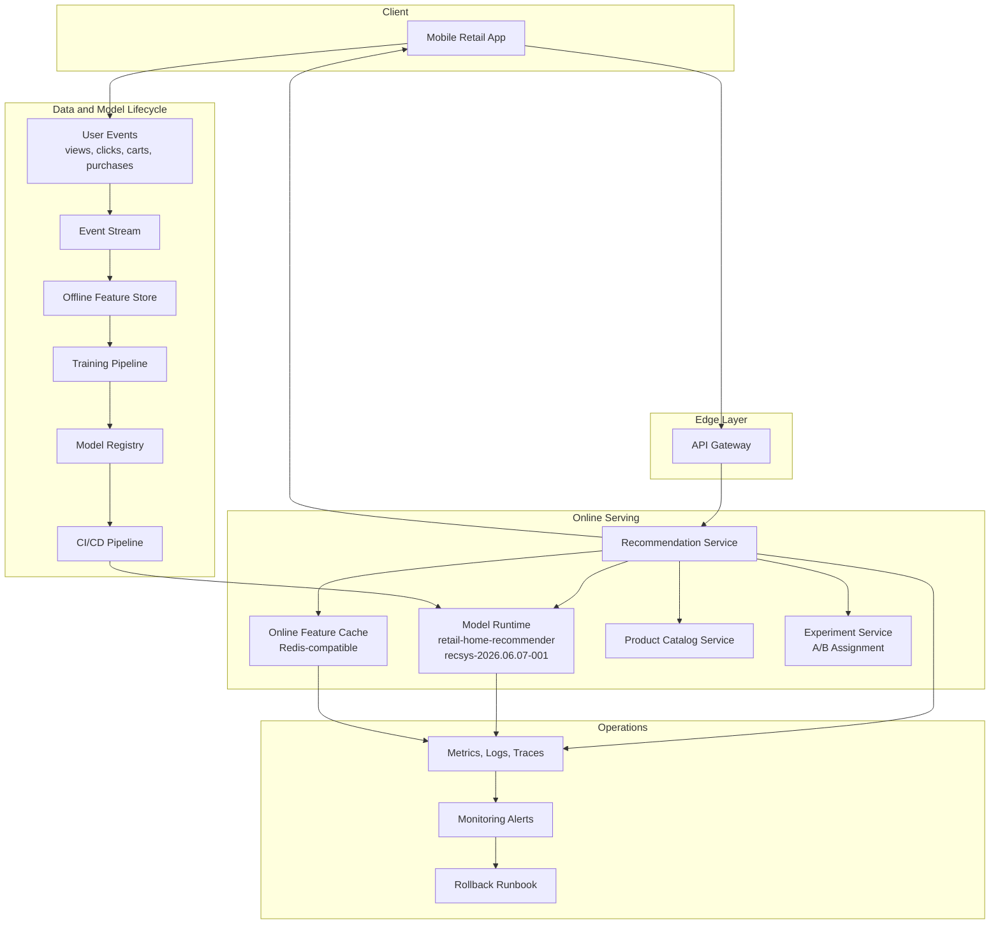
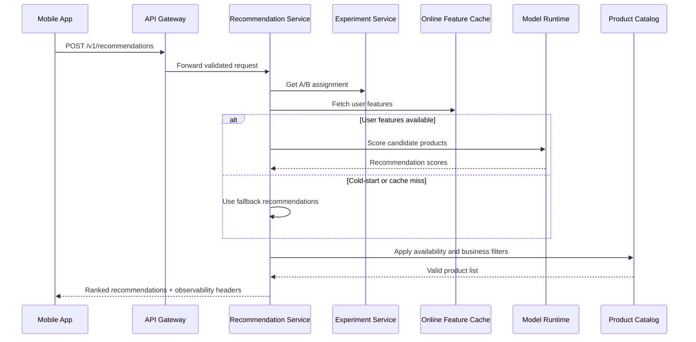
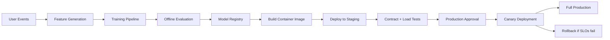

# Architecture

## Scenario

This system is designed for **Scenario X: personalized in-app recommendations for a B2C retail mobile application**.

The mobile app shows product recommendations every time a user opens the home screen. The system must support **800 RPS at peak** and keep the **end-to-end p95 latency under 120 ms**. Recommendations use the user's last 30 days of browsing and purchase history. Users with no history still receive safe fallback recommendations such as trending or popular products.

The goal of this repository is not to train a model. The goal is to design the production MLOps system around the model: serving, packaging, deployment, monitoring, and rollback.

---

## High-Level Architecture



---

## Online Request Flow



---

## Main Components

### Mobile Retail App

The mobile app requests recommendations when the home screen loads. It also emits user behavior events such as product views, clicks, add-to-cart actions, purchases, and searches.

These events are later used to build features and train future model versions.

### API Gateway

The API Gateway is the entry point for online traffic. It handles authentication, request routing, rate limiting, and request ID propagation.

Only validated traffic is forwarded to the Recommendation Service.

### Recommendation Service

The Recommendation Service owns the online recommendation flow. It reads features, calls the model runtime, applies fallback logic, attaches observability headers, and returns ranked products.

The service target is **60 ms p95 latency**, leaving the rest of the **120 ms end-to-end budget** for gateway, network, and client-side overhead.

### Online Feature Cache

The Online Feature Cache stores low-latency user features needed during serving.

Example features:

- recently viewed categories;
- recent purchases;
- preferred brands;
- preferred price range;
- last activity timestamp;
- cold-start indicator.

The target p95 lookup time is **20 ms**.

### Model Runtime

The Model Runtime serves the active production model:

```text
retail-home-recommender
```

Current production model version:

```text
recsys-2026.06.07-001
```

The model is baked into this container image:

```text
ghcr.io/acme-retail/retail-recommender:recsys-2026.06.07-001
```

This makes the deployed image, model version, registry entry, monitoring, and rollback plan consistent.

### Product Catalog Service

The Product Catalog Service filters recommendations based on product availability and business rules.

It removes products that are unavailable, expired, blocked, out of region, or not allowed by business policy.

### Experiment Service

The Experiment Service assigns users to A/B test variants. The Recommendation Service returns experiment metadata through response headers:

```text
X-Experiment-ID
X-AB-Variant
```

This allows online metrics to be compared across model variants.

### Model Registry

The Model Registry stores approved model versions and their metadata, including model version, image tag, dataset version, feature schema version, evaluation metrics, approval status, and rollback target.

Only approved model versions can be promoted to production.

### CI/CD Pipeline

The CI/CD pipeline validates, builds, scans, tests, and deploys the model-serving image.

The pipeline deploys first to staging, runs contract and load tests, then uses a production approval gate before canary rollout.

### Monitoring and Alerts

The system emits request, latency, error, fallback, cache, drift, and model-version metrics. Alerts are connected to the rollback runbook.

The served model version must match the production version in the registry. If not, the `ModelVersionMismatch` alert fires.

---

## Latency Budget

The system has a strict **120 ms end-to-end p95 latency budget**.

| Step | Target p95 |
|---|---:|
| API Gateway and network overhead | 20 ms |
| Feature cache lookup | 20 ms |
| Model scoring | 35 ms |
| Catalog filtering and business rules | 15 ms |
| Response serialization | 10 ms |
| Safety buffer | 20 ms |
| **Total** | **120 ms** |

The Recommendation Service itself targets **60 ms p95**.

---

## Capacity Assumptions

| Item | Value |
|---|---:|
| Peak traffic | 800 RPS |
| Expected safe throughput per replica | ~120 RPS |
| Initial replicas | 8 |
| Autoscaling range | 8–30 replicas |
| CPU per replica | 4 vCPU |
| Memory per replica | 8 GB |
| Model size estimate | ~250 MB |

Replica calculation:

```text
800 RPS / 120 RPS per replica = 6.67 replicas
```

The system starts with **8 replicas** to provide safety margin.

---

## Cold-Start Strategy

Cold-start users have no browsing or purchase history. The system must still return useful recommendations.

Fallback recommendations are based on:

- trending products in the user's region;
- popular products by category;
- seasonal campaigns;
- safe default business rankings.

Fallback usage is tracked with:

```text
recommendation_fallback_rate
```

A sudden spike in fallback rate may indicate a feature cache issue, broken event ingestion, or a model runtime problem.

---

## A/B Testing

A/B testing is part of the core design because the product team continuously evaluates recommendation changes.

Each response includes:

```text
X-Experiment-ID
X-AB-Variant
```

A model cannot be promoted based only on offline metrics. It must also pass:

- staging contract tests;
- staging load tests;
- canary SLO checks;
- business KPI review.

Important online KPIs include click-through rate, add-to-cart rate, conversion rate, and revenue per session.

---

## Model Deployment Flow



Deployment steps:

1. User events are collected from the mobile app.
2. Features are generated from browsing and purchase history.
3. A model candidate is trained and evaluated.
4. Approved models are registered in the Model Registry.
5. CI/CD builds a container image with the model baked in.
6. The image is deployed to staging.
7. Contract and load tests run in staging.
8. Production deployment requires approval.
9. The model is released through canary.
10. If SLOs or business metrics fail, the canary is rolled back.

---

## Observability

Every recommendation response must be traceable.

The service emits:

- request count by endpoint;
- p95 latency by endpoint and model version;
- error rate;
- feature cache latency;
- feature cache hit rate;
- fallback recommendation rate;
- active model version;
- feature drift metrics;
- A/B variant metrics.

The response includes:

```text
X-Request-ID
X-Model-Version
X-Experiment-ID
X-AB-Variant
```

Expected production model version:

```text
recsys-2026.06.07-001
```

If the served `X-Model-Version` does not match the expected registry version, monitoring raises `ModelVersionMismatch`.

---

## Failure Modes

| Failure | Expected Behavior |
|---|---|
| Online feature cache unavailable | Use fallback recommendations and raise alert |
| User has no history | Use trending and category-popularity fallback |
| Model runtime error | Return fallback recommendations and count model error |
| Product catalog unavailable | Return cached safe recommendations if available |
| New model causes latency regression | Trigger burn-rate alert and rollback |
| New model hurts canary KPIs | Stop promotion and roll back canary |
| Wrong model version is serving | Trigger `ModelVersionMismatch` |
| A/B experiment misconfiguration | Default to control variant |

---

## Key Design Decisions

The most important architecture decisions are documented as ADRs:

1. [`0001-bake-model-into-image.md`](adr/0001-bake-model-into-image.md)
2. [`0002-use-online-feature-cache.md`](adr/0002-use-online-feature-cache.md)