# Model Lifecycle

## Purpose

This document describes the end-to-end lifecycle for the `retail-home-recommender` model used in the personalized retail recommendation system.

The lifecycle covers the full path from user behavior data to production deployment:

```text
data collection
→ feature generation
→ training
→ evaluation
→ registry
→ staging
→ canary
→ production
→ monitoring
→ retraining or rollback
```

The goal is to make every production model version traceable, testable, auditable, and safe to roll back.

---

## Lifecycle Overview

```mermaid
flowchart LR
    Events["User Events<br/>views, clicks, carts, purchases"]
    Validation["Data Validation"]
    Features["Feature Generation"]
    Training["Training Pipeline"]
    Eval["Offline Evaluation"]
    Registry["Model Registry"]
    Staging["Deploy to Staging"]
    Contract["Contract Tests"]
    Load["Load Tests"]
    Approval["Production Approval"]
    Canary["Canary Deployment"]
    Prod["Full Production"]
    Monitor["Monitoring"]
    Retrain["Retraining Trigger"]
    Rollback["Rollback"]

    Events --> Validation
    Validation --> Features
    Features --> Training
    Training --> Eval
    Eval --> Registry
    Registry --> Staging
    Staging --> Contract
    Contract --> Load
    Load --> Approval
    Approval --> Canary
    Canary --> Prod
    Prod --> Monitor
    Monitor --> Retrain
    Monitor --> Rollback
    Retrain --> Training
```



---

## Production Model Identity

The current production model identity is fixed across the repository.

| Field | Value |
|---|---|
| Model name | `retail-home-recommender` |
| Production version | `recsys-2026.06.07-001` |
| Container image | `ghcr.io/acme-retail/retail-recommender:recsys-2026.06.07-001` |
| Model packaging | Baked into the container image |
| Expected API header | `X-Model-Version: recsys-2026.06.07-001` |
| Rollback target | `recsys-2026.05.31-004` |

The model version must match across:

- model registry;
- container image tag;
- CI/CD deployment;
- API response header;
- monitoring alerts;
- rollback runbook.

---

## Data Collection

The mobile app emits user behavior events that are used for personalization and future model training.

Example events:

- product view;
- product click;
- add to cart;
- purchase;
- search query;
- category visit;
- product impression.

These events are written to the event stream and later processed into offline features.

Each event must include:

| Field | Purpose |
|---|---|
| `event_id` | Unique event identifier |
| `user_id` | User identifier or anonymous session identifier |
| `event_type` | Type of interaction |
| `product_id` | Product involved in the event |
| `timestamp` | Event time |
| `device_type` | Mobile device type |
| `region` | User region |
| `experiment_id` | A/B test identifier if available |
| `ab_variant` | A/B test variant if available |

---

## Data Validation

Before features are generated, incoming data must pass validation checks.

Required checks:

| Check | Gate |
|---|---|
| Required fields present | 100% of events must include `event_id`, `event_type`, and `timestamp` |
| Duplicate event rate | Must be below 0.5% |
| Invalid product IDs | Must be below 0.2% |
| Future timestamps | Must be below 0.1% |
| Missing user/session ID | Must be below 1.0% |
| Event freshness lag | p95 must be below 15 minutes |

If a gate fails, the pipeline stops before training and creates a data quality incident.

---

## Feature Generation

The feature pipeline creates training and serving features from the last 30 days of user behavior.

Example feature groups:

| Feature Group | Examples |
|---|---|
| User activity | view count, click count, purchase count |
| Category preference | top viewed categories, top purchased categories |
| Brand preference | top interacted brands |
| Price preference | average viewed price, average purchased price |
| Recency | time since last view, time since last purchase |
| Cold-start | no-history indicator, anonymous-session indicator |
| Product popularity | regional trending score, category popularity |

The same feature definitions must be used for offline training and online serving. Any change to the feature schema creates a new feature schema version.

Current feature schema version:

```text
features-v2026.06.07
```

---

## Training Pipeline

The training pipeline creates a candidate model version.

The pipeline records:

- training dataset version;
- feature schema version;
- code commit SHA;
- training date;
- model hyperparameters;
- offline evaluation results;
- generated model artifact path;
- candidate container image tag.

For this assessment, no actual training code is required. The repository documents how the model would move through production lifecycle gates.

---

## Offline Evaluation Gates

A candidate model must pass offline evaluation before it can be registered for staging.

Required gates:

| Gate | Required Result |
|---|---|
| NDCG@10 | Must improve by at least 2% over current production or have approved business exception |
| Recall@20 | Must not decrease by more than 1% |
| Coverage | Must be at least 85% of active catalog |
| Cold-start recommendation coverage | Must be at least 95% |
| p95 local inference latency | Must be below 35 ms |
| Model artifact size | Must be below 300 MB |
| Feature schema compatibility | Must be compatible with `features-v2026.06.07` |
| Bias / segment check | No major regression for monitored user segments |

If any required gate fails, the model cannot be promoted to staging.

---

## Registry Promotion

After offline evaluation passes, the candidate is added to the Model Registry.

A registry entry must include:

- model name;
- model version;
- container image tag;
- artifact checksum;
- dataset version;
- feature schema version;
- offline metrics;
- latency test result;
- approval status;
- approvers;
- rollback target;
- lineage metadata.

The registry is the source of truth for which model version is approved for staging, canary, and production.

---

## Approval Roles

Model promotion requires named role approvals.

| Stage | Required Approver |
|---|---|
| Register candidate | ML Engineer |
| Promote to staging | ML Platform Engineer |
| Start production canary | Product Owner + ML Lead |
| Promote to full production | Product Owner + ML Lead + SRE |
| Emergency rollback | On-call SRE |

This prevents a model from moving to production based only on offline metrics.

---

## Staging Deployment

After registry approval, CI/CD deploys the candidate image to staging.

Staging validates:

- container starts successfully;
- `/health` returns healthy;
- `/ready` returns ready;
- OpenAPI contract is respected;
- `X-Model-Version` returns the candidate version;
- sync, batch, and async endpoints work;
- fallback response path works;
- metrics are emitted.

A model cannot continue to production canary if staging validation fails.

---

## Load Test Gate

The load test gate confirms that the service can handle the expected traffic profile.

The staging load test uses:

| Item | Value |
|---|---:|
| Target peak traffic | 800 RPS |
| Test peak traffic | 900 RPS |
| End-to-end p95 latency budget | 120 ms |
| Recommendation Service p95 target | 60 ms |
| Error rate limit | < 0.5% |
| Test duration | 30 minutes at peak |

The test uses 900 RPS to provide safety margin above the expected 800 RPS production peak.

---

## Canary Deployment

After staging passes, the model is deployed as a production canary.

Canary rollout stages:

| Stage | Traffic Share | Minimum Observation Window |
|---|---:|---:|
| Canary 1 | 5% | 30 minutes |
| Canary 2 | 25% | 60 minutes |
| Full production | 100% | After approval |

Canary checks include:

- p95 latency ≤ 120 ms end-to-end;
- Recommendation Service p95 ≤ 60 ms;
- error rate < 0.5%;
- fallback rate does not increase by more than 25% relative to baseline;
- no `ModelVersionMismatch` alert;
- no critical business KPI regression.

If any canary gate fails, the rollout stops and the system rolls back to the previous stable version.

---

## Full Production

After canary passes, the model can be promoted to full production.

Production version:

```text
recsys-2026.06.07-001
```

The production deployment must serve this header:

```text
X-Model-Version: recsys-2026.06.07-001
```

Monitoring must confirm that all production replicas are serving the expected version.

---

## Monitoring After Promotion

After full production promotion, the model is monitored continuously.

Important monitoring signals:

| Signal | Purpose |
|---|---|
| p95 latency | Detect user experience regression |
| error rate | Detect service or model failures |
| fallback rate | Detect cache, feature, or model issues |
| cache hit rate | Detect online feature problems |
| feature drift | Detect input distribution change |
| model-version mismatch | Detect wrong deployment |
| CTR / add-to-cart / conversion | Detect business impact |

Monitoring alerts are defined in:

```text
monitoring/alerts.yaml
```

Rollback instructions are defined in:

```text
runbooks/rollback.md
```

---

## Retraining Triggers

A retraining workflow should be started when one or more of these conditions are met:

| Trigger | Reason |
|---|---|
| Feature drift remains high for 24 hours | User behavior changed |
| CTR drops by more than 5% for 24 hours | Business performance regression |
| Catalog coverage falls below 85% | Model is not covering enough products |
| New major product category is launched | Feature and ranking behavior may change |
| Scheduled weekly retraining window | Keep model fresh |

Retraining does not automatically mean production deployment. Every new candidate must pass the same registry, staging, canary, and approval gates.

---

## Rollback Conditions

Rollback may be required when production becomes unhealthy.

Rollback triggers include:

| Trigger | Action |
|---|---|
| p95 latency exceeds 120 ms during burn-rate alert | Roll back to previous stable image |
| Error rate exceeds SLO burn-rate threshold | Roll back if linked to new model |
| Fallback rate increases more than 25% over baseline | Investigate and roll back if caused by model or feature schema |
| `ModelVersionMismatch` fires | Roll back or redeploy expected image |
| Canary business KPIs regress critically | Stop canary and revert |
| Feature schema incompatibility detected | Roll back model and feature schema |

The previous stable version is:

```text
recsys-2026.05.31-004
```

---

## Lifecycle Summary

The lifecycle is designed to make production model changes safe.

A model cannot go directly from training to production. It must pass:

1. data validation;
2. feature generation;
3. offline evaluation gates;
4. model registry entry;
5. staging deployment;
6. contract tests;
7. load tests;
8. production approval;
9. canary rollout;
10. monitoring checks.